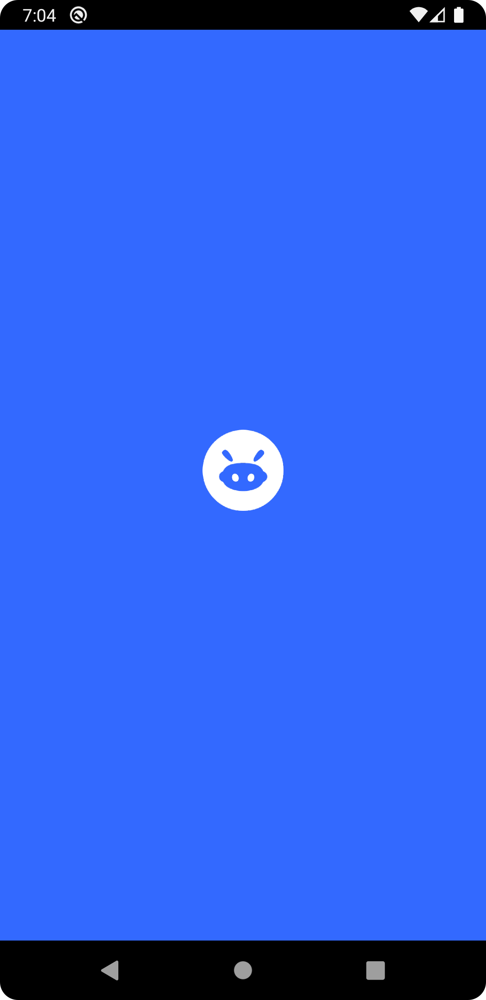
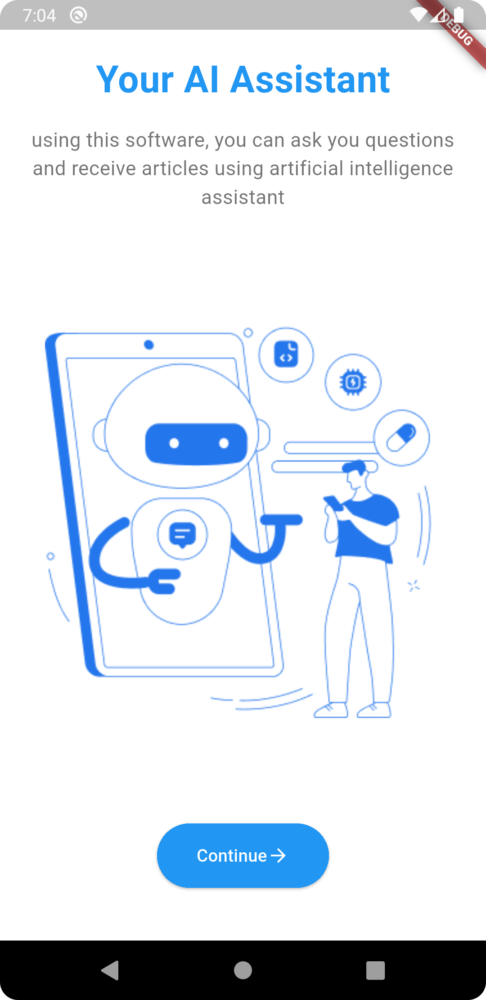

---

# 🤖 AI Assistance

**AI Assistance** is a Flutter-based application that leverages AI technologies to provide an
intelligent assistant experience. This app integrates Google’s generative AI and is built using
Flutter for a seamless cross-platform experience.

---

## 📸 Screenshots

<p align="center">
  
  
  
</p>

---

## ✨ Features

- 💬 AI-powered assistant using **Google Generative AI**
- 🌍 Cross-platform support (iOS, Android)
- 🖥️ Customizable splash screen
- 🛠️ State management with **Flutter Riverpod**
- 🌱 Clean and scalable code structure

---

## 🚀 Tech Stack

| Category   | Tech Used             |
|------------|-----------------------|
| Framework  | Flutter               |
| State Mgmt | Riverpod              |
| Splash     | Flutter Native Splash |
| AI         | Google Generative AI  |

---

## 📁 Folder Structure

```bash
.
├── assets/              # Images and other assets
│   ├── splashscreen.png # Splash screen image
├── lib/                 # Main application code
│   ├── screens/         # UI screens
│   ├── providers/       # Riverpod state management
│   └── main.dart        # Main app entry
├── .env                 # Environment variables for API keys
├── pubspec.yaml         # App dependencies and configuration
└── README.md            # Project documentation
```

---

## ⚙️ Getting Started

### 1. Clone the Project

```bash
git clone https://github.com/your-username/ai_assistance.git
cd ai_assistance
```

### 2. Install Dependencies

```bash
flutter pub get
```

### 3. Set Up Environment Variables

Create a `.env` file in the root directory and add any necessary keys, such as API keys for the
Google Generative AI integration.

Example:

```plaintext
GOOGLE_API_KEY=your-api-key-here
```

### 4. Run the App

```bash
flutter run
```

This will run the app on the connected device or simulator.

---

## 📱 App Configuration

### Splash Screen Configuration

The splash screen has been customized using the **flutter_native_splash** package. You can configure
the splash screen's color and image as follows in the `pubspec.yaml`:

```yaml
flutter_native_splash:
  color: "#3369FF"
  image: assets/splashscreen.png
  android: true
  ios: true
```

---

## 🧪 Testing

To run the tests (if any), you can use:

```bash
flutter test
```

---

## 🔮 Future Improvements

- 🔑 Integrate user authentication (Firebase, Google Sign-In)
- 🌐 Multi-language support for the assistant
- 🧠 Expand AI capabilities to more use cases (calendar, reminders, etc.)
- 📈 Implement analytics to track user interactions

---

## 📄 License

This project is licensed under the **MIT License**.

---

## 👨‍💻 Author

**Chinedu Aguwa**  
📧 [neduaguwa443@gmail.com](mailto:neduaguwa443@gmail.com)  
📞 +234 810 547 1046  
[LinkedIn](https://www.linkedin.com/in/chinedu-aguwa-b1747a2b0) • [GitHub](https://github.com/chi2785443)

---
